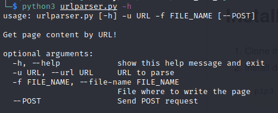

# Project 7: URL to word/text convertor

# Description
A Program to take any URL as User Input and and output the content of the URL in a word/text file.

# Screenshots


# Getting Started
Terminal is the easiest way to start. Bellow you can find the example how to use the urlparser.

# Motivation
Sometimes you want to get a page content without browser, so, you could use our tool utlparser!

# Installation
1. Clone this repository
2. Install dependencies
   ```bash
   pip3 install -r requirements.txt
   ```
3. Run `python3 urlparser.py -h` to show help menu

# Requirements
Python 3

## Take any url 

Example:

```
Run 'python3 urlparser.py -u http://google.com/ -f google.html' to get google page content
```
 If everything is okay, the content will be placed in the file specified as an argument

# Code example

The function that takes url and get contents:
```
def getDataByURL(url, post):
    data = ''
    if post:
        r = requests.post(url)
        data = r.text
    else:
        r = requests.get(url)
        data = r.text
    return data
```
# Credits
Alexey Posikera, Alisa Ivanova

# Liseince
free
